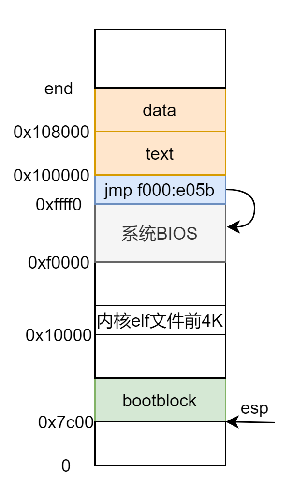
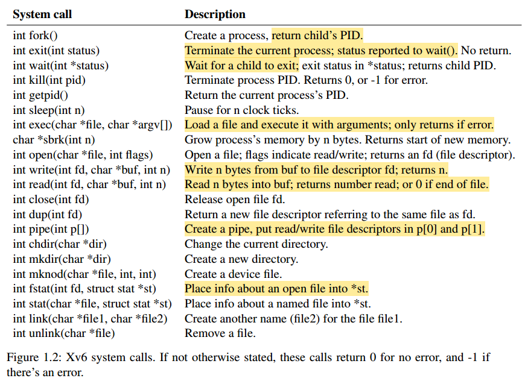
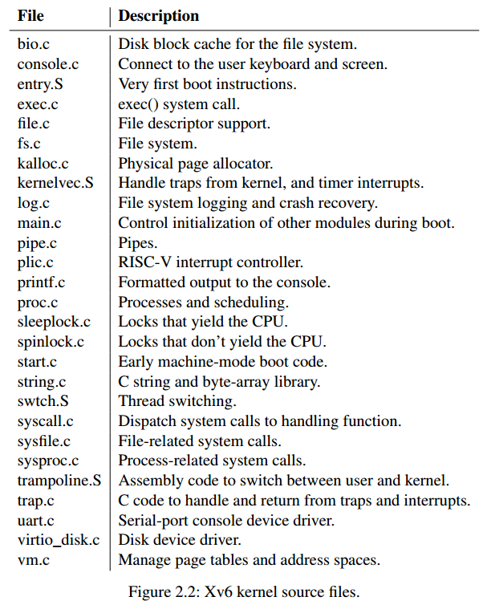
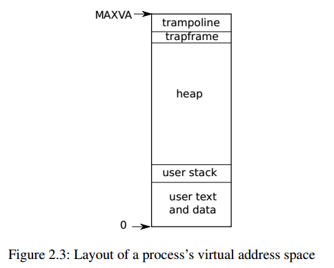
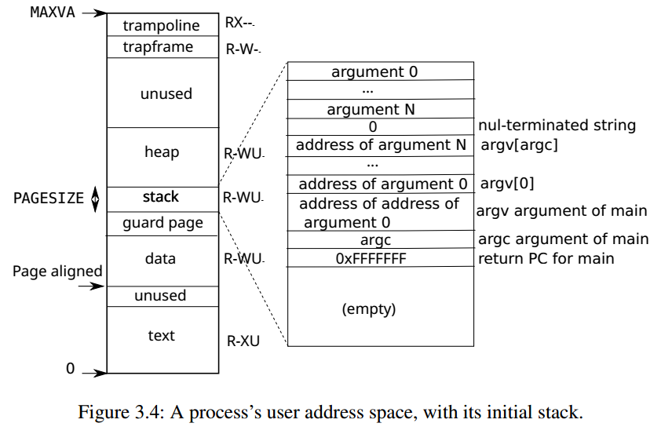

xv6操作系统代码学习

# 1. 操作系统启动
## 1.1 启动流程总览

  

## 1.2 加载引导程序
- 按下电源键后，CPU 会初始化所有寄存器，其中代码段寄存器 CS = 0xf0000，指令指针寄存器 IP = 0xffff0。然后，CPU 开始从 `0xffff0` 处执行指令。  
内存低 1M 的顶部 64KB 都是分配给 系统 BIOS 的。

  

  

- 地址 `0xffff0` 处只有一条指令：`jmp 0xf0000:0xe05b`，CPU 跳转过去之后开始执行 ROM 上的 BIOS 代码。  
  - **ROM (Read-Only Memory)**：只读存储器，是一种非易失性存储器。与随机存储器（RAM）不同，ROM 在掉电时不会丢失存储的数据。
  - **执行流程**：从 0xffff0 开始执行 BIOS 的代码，BIOS将启动盘上的第 0 扇区的 MBR 加载到 0x7c00。  
  - **说明**： xv6 并没有实际构造 MBR 结构，从 Makefile 中可以知晓最开始那个扇区写入的是 bootblock，bootblock 又是由 bootasm.S 和 bootmain.c 两文件经过一些列编译汇编链接再转换格式得来，这两个文件组成的程序就是充当下面说的 MBR 以及 Bootloader 的角色。  

  

- CPU 从 `0x7c00` 处开始执行 MBR(bootblock) 代码。  
  **MBR 的主要任务**：将 loader 加载到内存中，并将控制权交给 loader。  
  **MBR 的加载位置**：由于 MBR 是操作系统的一部分，具体加载地址可以由操作系统自己定义。
- **Bootloader** （bootmain.c文件）主要任务是将操作系统的内核加载到内存中。加载内核又分了两步：
  - 读取内核 elf 文件头到 0x10000
  - 将 elf 文件展开到正确的内存区域
- **引导程序完成后内存布局**  

  

## 1.3 加载操作系统内核

## 1.4 

# 2. 代码总览
## 2.1 系统调用总览  

  

  

## 2.2 内核源文件总览  

  

  

## 2.3 进程虚拟地址空间布局总览  
- 进程虚拟地址空间布局  

  

  
- 进程虚拟地址到物理地址  

  

  
- 进程用户栈布局  

  

  

